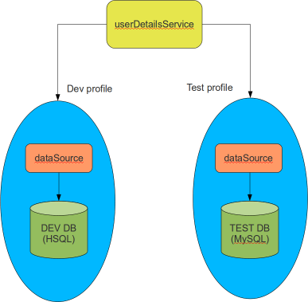

# Kurumsal Java Eğitimleri Şubat 2012

Merhabalar,

Soğuk ve karlı Ankara günlerinde sanırım hepimiz kendimizi biraz daha teknolojiye vermiş durumdayız. Bu ay sizlere Spring, 
Hibernate teknolojilerinde işinize yarayacağını düşündüğüm bazı özelliklerden ve gelişmelerden, ayrıca ilkini bu ay içinde 
gerçekleştirdiğimiz Java Teknoloji Saati etkinliğimizden bahsetmek istiyorum.

### Spring 3.1’de Bean Definition Profile Kabiliyeti

Yakın zamanda duyurulan Spring 3.1 ile gelen yenilikler arasında benim ilgimi çekenlerden birisi de “bean definition profile”
kabiliyeti oldu. Spring’i ilk çıktığından bu yana kullanan birisi olarak, uygulamaları farklı ortamlarda farklı bean 
gruplarını konfigüre ederek çalıştırmak için birkaç değişik yöntem izlediğimizi söyleyebilirim. Bunlardan en yaygın ikisi:

- property placeholder ile platforma göre ilgili sınıf veya bean isimlerinin konfigürasyon dosyalarından yüklenerek bean 
- tanımlarının oluşturulması,
- bean tanımlarını içeren XML dosya isimlerinin belirli ön veya son eklerle gruplanarak yüklenmesi

şeklinde özetlenebilir.

Farz edelim ki uygulamanızda Spring Security’nin `JDBC UserDetailsService` sınıfından bir bean tanımı olsun. Bu bean 
instance’ının çalışabilmesi için bir `JDBC dataSource` bean’ına ihtiyacı vardır. `DataSource` bean’i ise veritabanına
bağlanmak için sürücü sınıfı, veritabanı adresi, kullanıcı adı ve şifresi gibi bilgilere ihtiyaç duyar. Eğer geliştirme 
ve test ortamları için farklı veritabanları kullanıyorsanız her bir ortam için farklı bean grupları oluşturmak, bunları 
konfigüre etmek ve uygulama içerisinde yönetmek zorundasınız.

Bean Definition Profile yardımı ile belirli bir bean grubu bir isim altında gruplanarak bir sistem parametresi ile 
yüklenmeleri sağlanmaktadır. Bu sayede bean tanımları daha kolay okunur olmakta, ortama göre farklı tanım gruplarının
oluşturulması daha basit ve anlaşılır bir hal almaktadır.

### Hibernate 4 ile Gelen Yenilikler

Hibernate 4 sürümü bir süre önce yayımlandı. Şubat ayı içerisinde de 4.0.1 bakım sürümü çıktı. Spring 3.1 sürümü de 
Hibernate 4 desteği içermektedir. Kısacası artık etrafımızdaki kurumsal uygulamaların Hibernate 3’den Hibernate 4’e 
geçişleri değerlendiriliyor. Yeni başlayacak projelerde ise Hibernate 4’ün kullanılması daha ciddi biçimde tartışılıyor.
Hibernate 4 ile gelen yeniliklerden öne çıkanlar:

- Multi-tenant uygulama desteği
- Metamodel’deki iyileştirmeler
- Session oluşturma yönteminde değişiklikler
- Loglamanın I18N desteği ile yapılması

şeklinde sıralanabilir. Bu yenilikler arasında benim en çok ilgimi çeken multi-tenant uygulama desteği oldu. Hibernate 4
öncesi dönemde `Filter` kabiliyeti ile hayata geçirilebilen bu özellik Hibernate 4 ile birlikte daha sistematik biçimde 
ve ilk elden etkin hale getirilebiliyor. Bir sonraki bültenimizde multi-tenancy desteği üzerinde ayrıntılı biçimde duracağız.

### Java Teknoloji Saati Etkinlikleri

Şubat ayı içerisinde Java Teknoloji Saati etkinliklerimizin ilkini ODTÜ Teknokent’de geniş bir katılımla gerçekleştirdik. 
Bu ayki etkinlikte ilk olarak tasarım prensipleri ve tasarım örüntüleri ile esnek bir tasarım çıkarmayı sağlayacak yöntemler
üzerinde duruldu. İkinci sunumda ise son dönemin popüler açık kaynak BPM ürünü `Activiti` örnek bir iş akışı üzerinden 
anlatıldı. Java Teknoloji Saati etkinliklerini benzer konularla devam ettirmeyi amaçlıyoruz.

Her ne kadar ağırlıklı olarak Java teknolojilerine odaklansak da bu etkinlikte de olduğu gibi genel yazılım mühendisliği, 
nesne yönelimli programlama, tasarım örüntüleri gibi teknolojiden bağımsız konularla, yazılım geliştiricilerin hangi 
platform ve teknoloji ile çalışırlarsa çalışsınlar faydalanabilecekleri, en azından sektördeki diğer çalışanlarla bir 
araya gelerek bilgi ve fikir paylaşımı yapabilecekleri bir etkinlik formatımız var. Sunumlarımızda biraz teori, biraz da 
pratik her zaman olacak. Bu ayki etkinliğin detaylarına ve sunumlarına [buradan](http://blog.harezmi.com.tr/java-teknoloji-saati-etkinliginin-ardindan/) ulaşabilirsiniz.

Bir sonraki ay görüşmek dileği ile, herkese bol Java’lı günler…

Kenan Sevindik

**Kurumsal Java Eğitimleri**
- Spring Application Framework
- Spring Security ile Web Uygulama Güvenliği
- Spring MVC ve Web Servisleri
- Spring AOP ve AspectJ ile Aspect Oriented Programlama
- Hibernate ile Java Persistence
- J2EE Teknolojilerine Giriş
- Java ile Nesne Yönelimli Programlama
- Nesne Yönelimli Analiz, Tasarım ve Tasarım Örüntüleri

On-site kurum içi eğitimlerin yanı sıra, kurum dışında da eğitimler düzenliyoruz. Her türlü konuda bilgi almak, size özel
bir eğitim programı oluşturmak veya kurumsal uygulama geliştirme ile ilgili danışmanlık ve koçluk hizmetlerimiz için bizimle
[irtibata](http://www.harezmi.com.tr/#contact) geçebilirsiniz.

*“Kurumsal Java Eğitimleri”* bir **[Harezmi](http://www.harezmi.com.tr/) Bilişim Çözümleri A.Ş.** hizmetidir.
