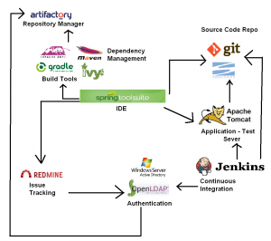

# Java EE Geliştirme Ortamı Bileşenleri – 1

Yazar: Muammer Yücel

Merhabalar. Bu yazımızda Java EE ile kurumsal uygulama geliştirme sırasında kullanılan metodolojilerden ve araçlardan 
bahsedeceğiz. Seçtiğimiz araçların mümkün olduğunca açık kaynak olmasına özen gösteriyoruz. Böylece ortaya, tüm yazılım 
yaşam döngüsünün tamamen açık kaynak yazılımlar kullanılarak yönetilebileceği bir platform koymuş olacağız.

Bahsedeceğimiz konular;

- build ve dependency araçları
- kurumsal bağımlılık yöneticisi
- sürüm kontrol sistemleri
- sürekli entegrasyon sistemleri
- test için sunucu
- hata/iş takip sistemleri

Platformumuzun içerdiği araçlar ve bu araçların birbirleriyle ilişkileri aşağıdaki gibidir.



### Maven Build ve Dependency Yönetim Aracı

[Maven](http://maven.apache.org/), Java projelerinin geliştirme süreçlerini basitleştirmek, standartlaştırmak, dökümantasyonlarını oluşturmak, 
kütüphane bağımlılıklarının yönetimini geliştiricilerin üzerinden almak amacıyla kullanılır.

Ant’ın, proje ile ilgili üst bilgi (meta data) içermemesi ve uzun build script’leri yazmayı gerektirmesi gibi nedenler 
Maven’in ortaya çıkmasına neden olmuştur. Ant ile yapılabilecek her şey Maven ile de yapılabilir.

Maven, proje geliştirme sürecinde aşağıdaki noktalarda kabiliyetler sunar:

- Projenin build işlemi
- Bağımlı kütüphanelerin yönetilmesi
- Proje sürümlerinin yönetilmesi
- Proje artifact’larının oluşturulması ve dağıtımı
- Dökümantasyon ve raporlama işlemleri
- SCM (Software Configuration Management)

### Gradle Build ve Dependency Yönetim Aracı

Java tabanlı projelerinizi inşa etmenize yarayan başka bir araç da Gradle’dır. Projelerimizin kaynak kodlarını alıp, JAR 
veya WAR oluşturma, testleri çalıştırma vb. kabiliyetler sunmaktadır.

Diğer build araçlarından farkı, bir script programlama dili ([Groovy](http://groovy-lang.org/)) ile yazılıyor olmasıdır. Bu durum, programcılara 
büyük esneklik kazandırmaktadır. Birden fazla projeyi yönetebilme (build etme, testleri çalıştırma vs.) kabiliyeti vardır.

### Kurumsal Bağımlılık Deposu Yöneticisi: Artifactory

[Artifactory](http://www.jfrog.com/home/v_artifactory_opensource_overview)’nin sunduğu hizmetler şunlardır:

- **Proxy**: İnşa aracınızla (Maven, Ant, Ivy, Gradle vs.) dış dünya arasında proxy görevi görür.
- **Local Cache**: Uzak artifact’leri tekrar tekrar indirmemek için onları önbelleğe alır.
- **Control**: Dahili artifact’ler için yapılan istenmeyen (ve bazen güvensiz) harici istekleri engeller ve artifact’lerin 
- nasıl, nereye ve kim tarafından deploy edileceğini kontrol eder.

Artifactory ile kurumunuzun kullandığı tüm artifact’ler ve üçüncü parti bağımlılıklar üzerinde kontrol sahibi olursunuz. 
Ayrıca, repository’nizi kurum içi departmanlar arasında ve/veya takımlar arasında paylaşabilirsiniz.

### Sürüm Kontrol Sistemleri

Sürüm kontrolü, genel manada bir dökümanın üzerinde yapılan değişikliklerin yönetilmesidir. Burada bahsedilen döküman bir 
ofis belgesi, web sitesi veya bir uygulama programı bile olabilir.

Yazılım geliştirme özelinde versiyon kontrolü (VCS, Version Control System), bir yazılımın revizyonlar halinde güncellenerek 
geliştirilmesini sağlar. Böylece geliştirilen yazılımın geçtiği süreçler rahatça takip edilebilir.

Sürüm kontrol sistemi kullanmanın faydalarını şu şekilde özetleyebiliriz:

- Birden fazla kişi aynı proje hatta aynı kod üzerinde çalışabilir ve bu değişiklikler tek bir kod dosyasına entegre edilebilir.
- Kodlar üzerinde yaptığınız değişiklikleri geri almak isterseniz, değişiklik yapılmadan önceki eski versiyonu sizin için saklar.
- Yazılan kodlar versiyon kontrol sistemi sunucusuna gönderilebilir, daha sonra istenen kısımlar indirilip üzerinde değişiklik yapılabilir.
- Farklı gereksinimler için farklı dallar (branch) oluşturup aynı anda birden fazla geliştirme yapabilir ve bu geliştirmeleri sonradan tek bir projede toplayabilirsiniz.
- Herhangi bir dosyanın eski sürümünü indirebilir, yeni sürümü ile arasındaki farkları görebilirsiniz.

#### SVN (Subversion)

[SVN](http://subversion.apache.org/) merkezi bir sürüm takip sistemidir. SVN yapısında kodlar merkezi bir sunucuda saklanır ve koda erişmek isteyen
kullanıcılar, kendilerine verilen kullanıcı adı ve şifre ile sunucu üstünde bulunan koda erişerek kodu kendi yerellerine 
indirirler (Check-out işlemi). Kod üzerinde gerekli güncellemeyi yapan kullanıcı, yine kodu sunucuya gönderir 
(Commit işlemi). Diğer kullanıcılar da kendi yerellerinde bulunan kodu güncel versiyonu ile değiştirebilirler 
(Update işlemi).

Bir SVN deposu aşağıdaki klasörleri içerecek şekilde yapılandırılır:

- **Trunk**: Bu klasör içinde projenin üstünde çalışılan versiyonu bulunur. Doğal olarak kararsız versiyondur. Müşteriye Trunk’taki kod teslim edilmez.
- **Branches**: Bu klasör içinde testi yapılmış, tamamen kararlı ve müşteriye teslim edilebilir haldeki versiyon bulundurulur. Ayrıca burada birden çok versiyon kod bulunabilir. Örneğin, üzerinde çalışılan proje birden çok fazdan oluşuyorsa, birinci faz bitirilince uygun bir etiketle Branches klasörüne kopyalanır.
- **Tags**: Bu klasör içine belli kilometre taşlarından geçmiş versiyonlar etiketlenerek koyulabilir. Böylece projenin gelişim süreci takip edilebilir.

SVN sunucusu olarak [**Collabnet Subversion Server**](http://www.collab.net/downloads/subversion) kullanılabilir. Bu paket program, Apache Subversion® ve Apache HTTP
server ürünlerini bir arada sunmaktadır.

#### Git

Gittikçe popülerleşen bir başka sürüm kontrol sistemi de [Git](http://git-scm.com/)’dir. Git’i diğer versiyon sistemlerinden ayıran özelliklerin 
başında dağıtık bir versiyon kontrol sistemi olması gelmektedir. Bir yazılımın kullandığı dosyalardaki değişikliklerin 
tüm tarihçesi (tüm versiyonları), dosyalar (son versiyon) ile birlikte bir sunucu üzerinde bulunur. Yazılım üzerinde 
geliştirme yapmak isteyen biri, yazılımı oluşturan dosyaları, tüm versiyonları ile birlikte yerel bilgisayarına alır 
(pull) ve Git ile bu dosyalarda yapacağı değişiklikleri kayıt altında tutmaya başlar. Geliştirme işlemi bittikten sonra 
istediği bir versiyonu sunucuya bırakır (push).

Subversion (SVN) gibi klasik versiyon kontrol sistemleri merkezi (centralized) dir. Yani, dosyalar ve bu dosyaların tek 
bir tane olan değişiklik tarihçesi vardır. Bu tarz sistemlerde kullanıcılar değişiklik tarihçesinin yerel bir kopyasına 
sahip değillerdir; sahip oldukları şey sadece üzerinde değişiklik yaptıkları dosyalardır. Değişiklik tarihçesine, yani 
eski versiyonlara, sahip değillerdir.

Peki versiyonlama sisteminin dağıtık olmasının ne gibi faydaları vardır? Projede birlikte çalışan kişi sayısının 
(collaboration) çok fazla olduğunu düşünelim. Bu kişiler merkezi bir versiyon kontrol sistemini kullanıyor olsun.
Herkes, üzerinde değişiklik yapmak istediği dosyaları merkezi sunucudan alsın. Değişikliklerini yaparken, önceki 
versiyondan dosyalar almaya ihtiyaç duyduklarında sunucuyla tekrar iletişime geçmek zorunda kalacaklardır. Önceki 
versiyonun alınmak istenmesinin çeşitli sebepleri olabilir; eski bir özelliği geliştirmek, yeni özelliği eski özellikle
karşılaştırmak, eski versiyondaki bir tasarım kalıbını yenisiyle karşılaştırmak gibi. Sunucuyla sürekli iletişime geçmek 
yerine bütün versiyonları bir anda yerel bilgisayarına alabilseydi, zaman kayıpları yaşanmayacaktı.

Ubuntu makinanıza Git’i aşağıdaki komutla kurabilirsiniz:

```bash
$ sudo apt-get install git
```

Windows için geliştirilen “msysgit” programını http://msysgit.github.com/ adresinden indirip kurabilirsiniz.

Burada birinci bölümü sonlandırıyoruz. Sürekli entegrasyon sistemleri, hata/iş takip sistemleri ve test sunucusu 
konularına bir sonraki bölümde devam edeceğiz.
