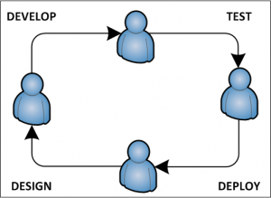

# Java EE Geliştirme Ortamı Bileşenleri – 2

Yazar: Muammer Yücel

Merhabalar. “Java EE Geliştirme Ortamı Bileşenleri” yazı dizimizin [birinci bölüm](http://blog.harezmi.com.tr/java-ee-gelistirme-ortami-bilesenleri-1/)ünde build ve dependency araçlarından 
(Maven, Gradle), kurumsal bağımlılık yöneticisinden (Artifactory) ve sürüm kontrol sistemlerinden (SVN, Git) bahsetmiştik. 
Bu bölümde sürekli entegrasyon sistemleri, test sunucusu ve hata/iş takip sistemlerinden bahsedeceğiz.

## Sürekli Entegrasyon Sistemleri

Sürekli Entegrasyon (Continuous Integration a.k.a. CI) sistemleriyle **Build**, **Test**, **Deployment**, 
**Quality Control** gibi aşamaları sürekli gerçekleştirerek projelerinizin tıkanan noktalarını tespit edebilir ve build 
edilen projelerinize ait kalite metriklerini toplayabilirsiniz. Elde edilen kalite metrikleri ile proje gidişatını 
değerlendirip daha kaliteli yazılımlar ortaya koyabilirsiniz. 

_“Sürekli Entegrasyon, programcı ekibi tarafından yapılan 
değişikliklerin sık aralıklarla sisteme entegre edilmesi için kullanılan yazılım geliştirme yöntemidir. Her programcı 
günde en az bir kere yaptığı değişiklikleri entegre eder. Bu sayede gün boyunca birden fazla entegrasyon gerçekleşir. 
Otomatik sürüm oluşturulması ve mevcut testler yardımı ile entegrasyon kontrol edilir. Birçok ekip tarafından sürekli 
entegrasyon metodu ile entegrasyon sorunlarının azaldığı tespit edilmiştir. Sürekli entegrasyon ile bir ekip hızlı bir 
şekilde kendi içinde bütün ve çalışır programlar yazabilmektedirler.” (Martin Fowler)_

Her zaman çalışır bir sürümün hazırda tutulması sürekli entegrasyonla sağlanmış olur. Ayrıca, günübirlik olarak gerçekleşen 
entegrasyonlar sayesinde programcıların projenin gidişatı hakkında aldıkları geri bildirim kuvvetlenmiş olur. Popüler CI 
sistemlerinden **Jenkins** ve onun atası olan **Hudson**’dan bahsedeceğiz.

### Jenkins
Jenkins, popüler bir sürekli entegrasyon aracıdır. Hudson geliştiricilerinin Oracle’ın politikalarından hoşlanmaması 
sonucunda Hudson’dan fork ettiği bir üründür. Tanımladığınız sürekli tekrarlanan işler (**job**) sayesinde, projelerinizi 
build edebilir, artifact’leri test sunucusuna veya artifact deponuza deploy edebilir, belirttiğiniz bir command script’i 
çalıştırabilirsiniz. Jenkins kurulumunun çeşitli yolları vardır. İster `jenkins.war` dosyasını indirip bir uygulama 
sunucusuna (örneğin GlassFish veya Tomcat) deploy edebilirsiniz. İster Windows native paketini indirip kurabilirsiniz. 
Bu paket sayesinde Jenkins bir **Windows Service** olarak kurulmaktadır.

### Hudson
Jenkins’in atası olan Hudson’ın kurulumu ve kullanımı Jenkins ile hemen hemen aynıdır. Community’de Jenkins’e rağbetin 
daha fazla olduğunu belirtmekte fayda var.

## Test Sunucusu
Web server yazılımlarının görevinden kısaca bahsedelim. Birer soket uygulaması olan bu yazılımlar, HTTP gibi protokolleri 
kullanarak üzerine kurulu oldukları server’a client’lardan gelen istekleri (**request**) dinleyen ve isteği kendisine 
deploy edilmiş (**kurulmuş**) web uygulamasına yönelten alt yapı yazılımlarıdır. Web uygulamaları gelen isteği işleyip 
çıktıyı üretir ve çıktı yine web server uygulaması tarafından istemciye gönderilir. Yani kısaca yazdığımız web 
uygulamalarının (ister statik isterse de Servlet, JSP, ASP.NET, PHP gibi dinamik) üzerinde çalışacağı bir web server 
yazılımına mutlaka ihtiyacı vardır. Java teknolojileri birden çok web server yazılımını desteklemektedir. Örneğin 
**Apache Tomcat**, **Jboss**, **GlassFish**, **WebSphere** gibi. Geliştirme yaparken de uygulamalarımızı yine bu sunuculara
deploy eder ve test ederiz. Popüler sunuculardan olan **Apache Tomcat**’i [http://tomcat.apache.org/](http://tomcat.apache.org/) 
adresinden indirebilirsiniz.

## Hata/İş Takip Sistemleri
Proje yönetiminin söze dayalı olması, insan faktörünün işin içine girmesiyle hata oranını oldukça arttırmaktadır. Bu nedenle
“söz uçar, yazı kalır” prensibinden yola çıkarak, proje yönetimini kayıt altına almaya yönelik araçlar geliştirilmiştir. 
**Redmine** da bunlardan birisidir. Redmine, açık kaynak, platform bağımsız, ve **Ruby on Rails** framework kullanılarak 
geliştirilen bir web uygulamasıdır.

### Redmine’ın öne çıkan özelliklerinden bazıları şunlardır:
- Birden fazla proje yönetebilme
- Esnek rol tabanlı erişim kontrolü
- Esnek iş takip sistemi
- Gantt çizelgesi ve takvim desteği
- Haber, döküman ve dosya yönetimi
- Feed ve e-mail bildirimleri
- Her projeye wiki sayfası desteği
- Her projeye forum desteği
- Zaman takibi
- SCM entegrasyonu (SVN, CVS, Git, Mercurial, Bazaar ve Darcs)
- E-mail ile issue oluşturma
- Çoklu LDAP authentication desteği
- Kullanıcıların kendi kendilerine kayıt olma imkanı
- Çoklu dil desteği
- Birçok database sistemini destekleme

## Özetleyecek olursak,
- Build aracı olarak [**Maven**](http://maven.apache.org/),
- Bağımlılık deposu olarak [**Artifactory**](http://www.jfrog.com/home/v_artifactory_opensource_overview),
- Sürüm kontrol sistemi olarak [**Git**](http://git-scm.com/),
- Sürekli entegrasyon aracı olarak [**Jenkins**](http://jenkins-ci.org/),
- Test sunucusu olarak [**Apache Tomcat**](http://tomcat.apache.org/),
- Hata/iş takip sistemi olarak [**Redmine**](http://www.redmine.org/)

kullanarak Java EE uygulamalarınızı tamamen açık kaynak hava sahasında geliştirebilirsiniz.
