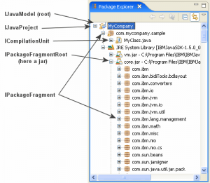
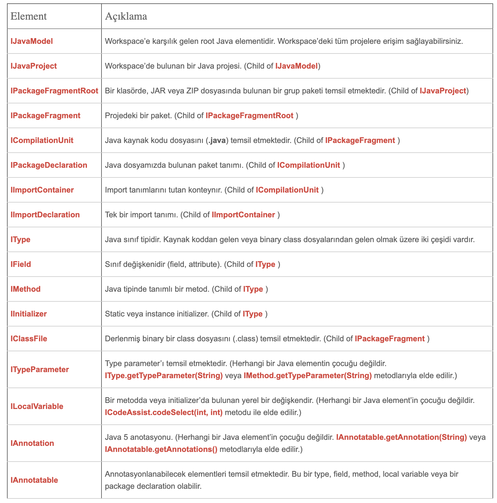
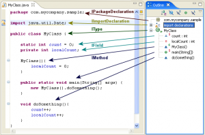

# Eclipse Java Development Tools (JDT)

Yazar: Murat Öksüzer

Merhabalar. Bu yazımızda Eclipse’in kendi içinde de kullandığı ve plugin geliştiricilere de sunduğu JDT teknolojisinden 
bahsedeceğiz. JDT sunduğu araçlarla bir Java programını modelleyerek içeriğini okumayı veya üzerinde düzenlemeler yapmayı 
mümkün kılıyor. Biz de geliştirdiğimiz model diagram pluginlerinde ürettiğimiz kod ile model senkronizasyonunu sağlayabilmek 
için bu teknolojiden faydalanıyoruz.

JDT kullanmak istediğiniz plugin projelerinde plugin.xml > Dependencies bölümüne “org.eclipse.jdt.core” isimli plugini 
eklemeniz gerekmektedir.

## Java Model

Bir Java projesini meyana getiren elementleri aklımıza getirelim. Paketler, sınıflar, sınıfların içerisine girdiğimizde, 
metodlar, sınıf değişkenleri (attributes, fields), anotasyonlar… JDT tüm bunlar için bize hiyerarşik bir yapı sunmaktadır.







## Örnek Kod

Bu yapıları elde etmek için Eclipse’in resource nesneleri kullanılmaktadır. Mesela bir java dosyasını IFile objesi olarak 
ele aldığımızda aşağıdaki kodlar ile JDT araçlarını kullanabiliriz

```java
// Workspace'e ulaşacağımız nesne
IWorkspace workspace = ResourcesPlugin.getWorkspace();
IWorkspaceRoot root = workspace.getRoot();
//Workspace'de bulunan tüm projeler
IProject[] projects = root.getProjects();
//İçinde SampleClass.java dosyası oluşturduğumuz bir projeyi seçiyoruz.
Iproject project = projects§ff8fcb748aafb4ac9ff9ce9cd085d3e1§;
IFile javaFile = project.getFile("SampleClass.java");
IJavaElement cu  = JavaCore.create(javaFile);
ICompilationUnit compilationUnit = (ICompilationUnit) cu;
IType type = compilationUnit.getType("SampleClass");
```

Bu sınıfta tanımlanmış fieldları ve metodları aşağıdaki kod ile elde edebiliriz. .getSource() metodu ile de kaynak kodunu 
elde edebiliriz.

```java
IMethod[] methods = type.getMethods();
IField[] fields = type.getFields();
String sourceCode = methods§20acb675f863e0fa6131859626676ca7§.getSource();
```

Bu sınıf elemanlarının modifier’larını (public, private, static, final, vs.), kendilerinden elde ettiğimiz flags değerini 
kullanarak tek tek Modifier sınıfında tanımlanan metodlar ile kontrol etmemiz gerekmektedir. Mesela bir field’ın static, 
final olup olmadığını aşağıdaki kod ile öğrenebiliriz.

```java
int flags = iField.getFlags();
boolean isStatic = Modifier.isStatic(flags);
boolean isFinal = Modifier.isFinal(flags);
```

## Kod Düzenleme

Şimdi de JDT kullanarak yeni bir paket ve bu paketin içinde yeni bir java dosyası oluşturan kodu görelim.

```java
// iProject bir IProject nesnesidir.
IJavaProject projectModel = JavaCore.create(iProject);

IFolder folder = resource.getFolder("/src/main/java");

try {

    IPackageFragmentRoot srcFolder = projectModel.getPackageFragmentRoot(folder);
    
    IPackageFragment fragment = srcFolder.createPackageFragment("yenipaket", true, null);
    
    //init code string and create compilation unit
    String str = "package yenipaket;" + "\n"
    + "public class TestDeneme  {" + "\n" + " private String name;" + "\n" + "}";
      ICompilationUnit compilationUnit = fragment.createCompilationUnit("TestDeneme.java",str, true, null);
      IType testDenemeType = compilationUnit.getType("TestDeneme");
    
    // Bir field tanımlıyoruz.
    testDenemeType.createField("private String age;", null, true, null);
    
    IField[] fields = testDenemeType.getFields();
    for (IField iField : fields) {
    System.out.println( "field: " + iField.getElementName() + " typeSig:" + iField.getTypeSignature() );
    }
} catch (JavaModelException e1) {
    throw new RuntimeException(e1);
}
```

JDT ile yapabileceklerini bununla sınırlı değil. Bu teknoloji ile ;

- Bir java projesini düzenleyebilir veya derleyebilirsiniz ([JDT Core](http://help.eclipse.org/indigo/topic/org.eclipse.jdt.doc.isv/guide/jdt_int_core.htm))
- Test veya debug edebilirsiniz ([JDT Debug](http://help.eclipse.org/indigo/topic/org.eclipse.jdt.doc.isv/guide/jdt_int_debug.htm))
- IDE’nin user interface desteğini kullanabilirsiniz ([JDT UI](http://help.eclipse.org/indigo/topic/org.eclipse.jdt.doc.isv/guide/jdt_int_ui.htm))