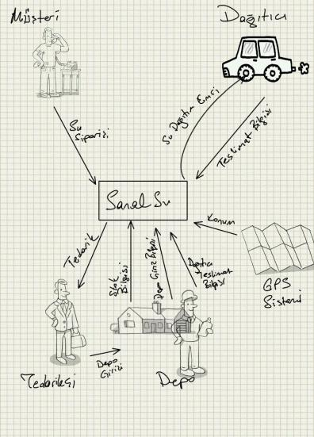

# 3,2,1… ve Project Blast-off

Yazar: Muammer Yücel

“Not what he wants but what he never dreamed that he wanted; and when he gets it, he recognizes it as something he wanted 
all the time.”

Mimar Denys Lasdun

“Yazılım Projelerinde Gereksinim Analizi” adlı yazı dizimize blast-off çalışması ve amacı ile devam edeceğiz. Blast-off 
çalışması, gereksinim analizinin ilk ve belki de en önemli adımıdır. Bu çalışma blast-off, kick-off ya da project launch 
gibi çeşitli adlarla isimlendirilebilir. Konunun önemine de atıfta bulunmak adına, ben bu yazımın başlığında “uzay mekiği 
fırlatmak” anlamına gelen blast-off kelimesini kullanmayı uygun gördüm.

Farz edelim ki, projenize başlamak üzere paydaşlarla ilk toplantı organize edildi. Bir kısmını ilk kez gördüğünüz bir grup 
insan ile birlikte bir masa etrafında toplandınız. Kısa bir tanışma faslından sonra söz aldınız ve kendinizden emin bir 
şekilde, amaca yönelik olarak, ağzınızdan şu sözcükler döküldü:

– Öncelikle hoş geldiniz. Bugün X projesi için gereksinim analizine başlamak için burada toplandık. Sözü fazla uzatmadan 
konuya girmek istiyorum. Gereksinimleriniz nelerdir?

Tam karşınızda oturan heyecanlı bey öne atıldı ve:

– Dağıtıcılardan gelen aylık satış istatistiklerinin genel müdürümüz tarafından tek tuşla raporlanıp yazdırılabilmesini 
istiyoruz.

Yanınızda oturan teknik arkadaş aynı heyecan ile devam etti:

– Bu veriler dağıtıcılar tarafından tablet bilgisayarlar ile girilsin ve sisteme web servisleri ile gönderilsin.

Kafanızda uçuşan kavramlar ve bir kısmını belki de ilk kez duyduğunuz sözcüklerin verdiği sarhoşlukla söylenenleri daha 
sonra tekrar hatırlamak için not almaktan başka elinizden başka bir şey gelmediğini fark ettiniz. Bu aşamada geri dönüşü 
zor bir yola girdiniz. Keşke bu soruyu hiç sormamış olsaydınız.

Hiç bilmediğiniz, ıssız bir adaya düşseniz adayı keşfetmeye ilk olarak nereden başlardınız? Öncelikle çevrenizde ne var 
ne yok ona bakardınız öyle değil mi? Blast-off toplantılarında da projenin amacını net olarak ortaya koyup, katılımcılarla 
hemfikir olduktan sonra ilk olarak alınması gereken aksiyon komşu sistemlerle birlikte çevreyi tanımaktır.

Peki ama nasıl? Bu sorunun cevabını basit bir senaryo üzerinden bulmaya çalışalım: Örneğin piyasanın önde gelen su dağıtım 
şirketlerinden “Sanal Su” için bir sipariş yönetim sistemi geliştirmek istediğimizi düşünelim. Öncelikle amacımızı ve bu 
proje ile elde etmek istediğimiz faydaları net bir biçimde ortaya koyalım:

– Amacımız su sipariş sürecini daha yönetilebilir bir hale getirerek müşteri memnuniyetini artırmak. Bunun sonucunda elde 
etmeyi umduğumuz faydalar; müşteri siparişlerini almak için çağrı merkezi operatörlerinin harcadıkları süreyi %50 oranında 
azaltmak; şehir içerisinde en geç yarım saat içinde teslimat yapabilmek; depolardaki stok durumunu anlık olarak takip 
edebilmek…

gibi kazanımlar olsun. Söze amaç ve beklentilerimizin ne olduğuyla başlayarak hem projemizin kapsamını ve sınırlarını 
kabaca ortaya koyduk, hem de toplantıdaki katılımcıların kafasındaki düşünceleri netleştirmiş olduk. Projenin amacı ve 
elde edilmesi beklenen faydalar hakkında tüm paydaşlarla fikir birliğine vardıktan sonra yapılması gereken, ortaya konacak 
çözüm (to be) ve teknik ayrıntılara takılmadan mevcut işleyişi (as is) anlamak olmalıdır:

– Müşterilerden sipariş geldiğinde müşterinin adresine en yakın dağıtıcıyı tespit ediyoruz. Bunun için yeni aldığımız GPS 
sistemini kullanıyoruz. Dağıtıcıya teslimat emrini veriyoruz, o da teslim edip bize bilgi veriyor. Elinde mal kalmadığında 
en yakın depodan yükleme yapıyor. Depo, yapılan yüklemeyi bize bildiriyor. Elindeki stok azaldığında tedarikçiyi arayıp
sipariş veriyoruz. Sipariş depoya teslim edildiğinde depocu bizi arıyor ve ödemeyi yapıyoruz…

İşin uzmanı kişi konuşmaya devam ederken duyduklarımız ışığında komşu sistemler ve etkileşimleri not defterimize çizelim:

Basitçe bir sayfaya sığdırdığımız bu çizime literatürde work-context adı verilir. Yapılan işin sınırlarını, komşu 
sistemlerle ya da kişilerle (teknoloji önemli değil) olan etkileşimleri ve projenin kapsamını belirlemek için mutlaka 
work-context’i net bir biçimde ortaya koymak gerekir.

### Blast-off çalışmasının amaçları;

- Projenin amacını ve elde edilmesi beklenen faydaları net bir şekilde ortaya koymak,
- Work-context’i ortaya çıkarmak ve buna bağlı olarak kapsamın sınırlarını çizmek,
- Work-context’te yer alan etkileşimleri belirlemektir.

Work-context’te yer alan komşu sistemlerle olan etkileşimlere business event‘ler denir. Örneğin müşteriden alınan su 
siparişi bir business event’tir ve bir takım olayları tetiklemektedir. Her bir business event’in bir hikayesi, senaryosu 
ve alt adımları vardır. Bunlar use case’lere ve karşılanması gereken gereksinimlere temel teşkil edecektir. Her bir 
business event, bir sonuç elde etmek içindir ve elde edilmesi beklenen sonuç, projenin amacına hizmet etmektedir. Bu 
nedenle, mevcutta var olan her bir business event’in karşılığı ortaya koyulacak çözümde de olmalıdır.

Blast-off çalışmasına hak ettiği önemi mutlaka vermeliyiz. Bu aşamada yapılacak hatalar ve eksiklikler ileride, sahip 
olması gereken bazı fonksiyonaliteleri sunmayan bir ürün olarak karşımıza çıkabileceği gibi gereksiz, hiç ihtiyaç 
duyulmayan fonksiyonalitelere sahip bir ürün olarak da karşımıza çıkabilir.

Unutmayalım ki, İngiliz mimar Denys Lasdun’un da söylediği gibi, karşımızdaki insanlar bizlerden aslında hiç hayal bile 
edemediklerini gerçekleştirmemizi bekliyorlar. Bu nedenle ne istedikleri ile ilgilenmeye başlamadan önce ne yaptıklarını 
anlayarak işe başlamalıyız.
