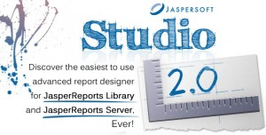

# JasperReports ve Jaspersoft Studio Tecrübeleri

Yazar: Murat Öksüzer

[Jaspersoft](http://www.jaspersoft.com/), [IReport](http://community.jaspersoft.com/project/ireport-designer)‘dan sonra, 
Java camiasından gelen Eclipse platformu desteği isteklerine [Jaspersoft Studio](http://community.jaspersoft.com/project/jaspersoft-studio) ile cevap 
verdi. Yapılan duyuruda Aralık 2015’e kadar IReport’un maintain edileceği yani kritik hataların düzeltileceği fakat yeni 
özelliklerin eklenmeyeceği belirtildi. Bundan sonra resmi [JasperReports](http://community.jaspersoft.com/project/jasperreports-library) tasarım aracı olarak Jaspersoft Studio’yu 
destekleyeceklerini ve developerlara da bu araca geçiş yapmalarını tavsiye etti.

## Ayrı IDE olarak mı Yoksa Eclipse Plugin olarak mı Kullanmalı?

Jaspersoft Studio başlı başına bir IDE olarak kullanılacağı gibi, Eclipse plugin versiyonu da sunulmakta. Bu plugini 
kurarak uygulama geliştirme ve rapor tasarım işlerinizi tek bir noktadan yönetebilirsiniz. Kişisel tecrübelerim gösterdi 
ki, plugin olarak kullanmak IDE’ler arası geçişlerde yaşanan context-switch’den kaynaklanan dikkat dağınıklığını engelliyor. 
Ayrıca, raporlarda kullanılan domain sınıflarının tanınması için bu sınıfların binary versiyonlarının (`.class` veya `jar`) 
Jaspersoft Studio’daki projenize eklenmesi gerekmektedir. Raporlar karmaşıklaştıkça, uygulama geliştirme ortamınızdan rapor 
tasarım ortamınıza taşımanız gereken binary sayıları da çoğalmakta. Bu binarylerin geliştirme sürecinde kaynak kodlarıyla 
senkronize tutulması da ayrı bir sıkıntı doğuruyor. Eğer Eclipse Plugin olarak uygulama geliştirme ortamınızla entegre 
bir şekilde kullanırsanız, bu classpath sorunlarıyla uğraşmaya gerek kalmıyor.

## Karşılaşılan Bazı Buglar

Programı kullanırken karşılaştığım sıkıntıları paylaşmakta fayda var diye düşünüyorum.

- **Field** nesnelerinin “Description” bölümüne imleci getirip de boş bırakırsanız, bu değer `null` olmaktan çıkıyor ve 
boş String değerini alıyor. Rapor üretilirken verilen bean’de bu field’ın değerini ararken eğer `description` `null` 
değil ise `name`’ine göre değil, `description` değerine göre reflection yaparak field’ın değerini bulmaya çalışıyor. 
“Description” `null` olmaktan çıktığı için `""` isminde bir property arıyor fakat doğal olarak bulamadığı için hata alıyor.

- **Link target** “Blank” ve type’ı “Reference” seçilen hyperlinklerin PDF çıktılarında çalışmadığını gördüm. Target’ı 
“Self” yaparak bu sorun aşılabiliyor.

- Sorun yaşadığım bir başka bölüm de **Nested list** yapısı kurmak. List component’ında kullanmak istediğiniz parametreleri 
main rapordan list component’ına geçirmeniz gerekmektedir. List’in içinde başka bir list yapısı kurmak istediğinizde, 
main rapordan bu nested liste geçirilen parametreler `null` geliyor. Bu durum nedeniyle nested list yerine subreport 
kullanmayı tercih etmek zorunda kaldım.

Şimdilik paylaşacaklarım bu kadar. Bugsız günler dilerim...
