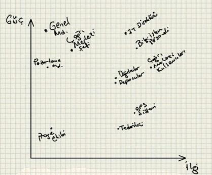
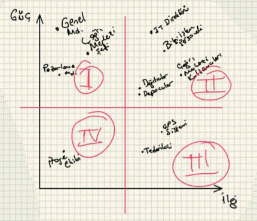

# Paydaş Analizi

Yazar: Muammer Yücel

“Yazılım Projelerinde Gereksinim Analizi” adlı yazı dizimize paydaş analizi ile devam ediyoruz. Paydaşlar, projenin 
geliştirme sürecinde aktif olarak rol alan ve projenin sonuçlarından, olumlu ya da olumsuz, bir biçimde etkilenecek olan 
kişi ya da kuruluşlardır. Gereksinim analizine başlamadan önce paydaşlarımızı analiz etmeliyiz. Çünkü paydaşların katkıları 
proje çıktılarına ve elde edilecek sonuçlara doğrudan doğruya etki edecektir.

Yazılım dünyası; belirlenen bütçe ve zaman kısıtlarını aşmadan, belirli kalite standartlarında ve tam olarak gereksinimleri 
karşılayacak şekilde geliştirilmiş olmasına rağmen X departmanının yöneticisinin “yersiz” kaprislerinden dolayı devreye 
alınmayan birçok “başarı hikayesi” ile doludur. “Kaldırın şu uygulamayı, bana mı sordunuz devreye alırken? Ben bu koltukta 
oturduğum sürece bu proje devreye alınamaz!” mahiyetinde hiddetle söylenmiş bir grup sözcük tüm emeklerin heba olması için 
yeterlidir. Çoğu zaman dile getirilemese de içten içe fatura, “kaprisli” ve “geri kafalı” yöneticiye kesilir. Ancak ortaya 
çıkan sorunun asıl kaynağı, onca insanın emek verip gerçekleştirdiği projenin devreye alınmasını engelleyebilecek güçteki 
bir kişinin fikrinin alınmamış olmasıdır.

Analiz çalışmaları boyunca gereksinimleri toplamak için farklı kişiliklerde, farklı işler yapan, farklı görevler üstlenen 
birçok kişinin fikrini almamız gerekecektir. Bu fikirler belirli bir hedef ve mantık çerçevesinde çoğu zaman örtüşse de 
birbiri ile çelişen karşıt görüşlerle karşılaşma ihtimali de her zaman söz konusudur. Bu tür durumlarda hangi fikri 
benimseyip hangisini göz ardı etmemiz gerektiği çoğu zaman fikri beyan eden kişilerin yani projedeki paydaşlarımızın konumu 
ile yakından ilgilidir. Bu nedenle işe başlamadan önce paydaşlarımızı net bir şekilde belirlemek ve ilk olarak onları analiz
etmek son derece önemlidir.

Paydaşlarımızı tanımlamak için ilk olarak kendi kendimize sormamız gereken soru, “Bu projede söz sahibi olacak, projeden 
olumlu ya da olumsuz bir biçimde etkilenecek, projeye katkı sunmasını beklediğimiz kişiler kimlerdir?” olmalıdır. Bu 
sorunun cevabı projenin sponsoru, müşteriler, kullanıcılar, satış departmanı, proje ekibi şeklinde olabilir. Projenin 
başında tüm paydaşları tek başımıza tespit etmemiz çok da kolay olmayacaktır. Bu nedenle projenin sponsoru, müşterilerimiz 
ve bağlı bulunduğumuz yöneticilerle bu çalışmayı yapmak önemlidir.

Bir önceki yazımızda verdiğimiz “Su Sipariş Uygulaması” örneği üzerinden devam edelim. Kısaca hatırlayacak olursak; 
müşterilerinden telefon ile su siparişlerini alan ve seyyar dağıtım ekipleri üzerinden bu siparişleri teslim eden bir su 
dağıtım firması için bir uygulama geliştirilmesi planlanmaktaydı. Mevcut durumda siparişleri çağrı merkezi çalışanları 
karşılamakta, uygun dağıtıcıyı GPS sisteminden yararlanarak tespit etmekte ve siparişi dağıtıcıya bildirmekteydi. Ayrıca 
bunun dışında tedarik ve depolama süreçleri de yürütülmekteydi. Bu projedeki muhtemel paydaşlarımızı aşağıda listelemeye 
çalışalım:

- Sanal Su Genel Müdürü
- IT Direktörü, sponsorumuz
- Bilgi İşlemciler, teknik arkadaşlar
- Çağrı Merkezi Şefi (Etkisinin azalacağını düşündüğü için projeye negatif bakıyor)
- Pazarlama Müdürü (Eleştirel yaklaşıyor, projenin müşteri memnuniyetine katkısını önemsiyor)
- Tedarik Firması
- Depocular
- Dağıtıcılar
- Çağrı Merkezi Kullanıcıları
- ABC GPS Sistemleri A.Ş.
- Proje Ekibimiz

Bu liste projeden projeye farklılık gösterir ve ne detayda olacağına iyi karar vermemiz gerekir. Önemli olan, özellikle 
projede söz sahibi olacak yetki sahibi paydaşları, proje ile yakından ilgili kişileri listeye dahil ettiğimizden emin 
olmaktır. İlk aşamada paydaşlarımızı tanımladıktan sonra, ikinci aşamada ise bu paydaşları kategorize etmek gereklidir.
Bunun için paydaşları eksenleri güç ve ilgi olan bir grafiğe yerleştirelim:

Paydaşlarımızı grafiğe yerleştirdikten sonra grafiğimizi dörde bölelim:

1. **I. Bölge**: Birinci bölgedeki paydaşlar, proje ile doğrudan doğruya ilgisi olmamasına rağmen projenin başarılı bir 
biçimde sonuçlanıp devreye alınmasında büyük etki sahibi olan kişilerdir. Projenin ilerleyen safhalarında beklenmeyen 
durumlarla karşılaşmamak için bu kişileri gerekli ve yeterli miktarda bilgilendirmek, periyodik olarak ilerleyiş hakkında 
rapor vermek, bu kişilerin beklentilerini karşılamak önemlidir.

2. **II. Bölge**: Bu kısımda yer alan kişilerin hem projenin ilerleyişine önemli katkıları olacaktır hem de belirli yetkilere 
sahip oldukları için alınacak kararlarda söz sahibi olacaklardır. Bu nedenle bu kişilerle yakın temasta olmak gereklidir.

3. **III. Bölge**: Bu kısımda yer alan paydaşların projenin ilerleyişine çok fazla etkisi olmasa da fikirlerinin alınması,
gerekli şekilde bilgilendirilmesi önemlidir. Örneğin projenin son aşamasında, GPS sistemi ile yapılacak bir entegrasyonda 
“Biz bu bilgiyi gönderemeyiz.” gibi bir cümleyi duymak çok hoş olmayacaktır. Bu nedenle bu kişileri yeteri kadar ve 
zamanında bilgilendirmeli, fikirlerine değer vermeliyiz.

4. **IV. Bölge**: Bu kısımda yer alan paydaşları düzenli olarak takip etmek ve izlemek yeterlidir.

Paydaş analizi, proje yönetimi bağlamında büyük bir öneme sahiptir. Grafiğin dikey eksenindeki dağılım analistten çok 
proje yöneticisinin ilgi alanına girmektedir. Öte yandan yatay eksendeki dağılım analiz aşamasında karşılaşılan 
çatışmalarda doğru yönü bulabilmek için oldukça önemlidir. Bu nedenle gereksinim analizinde özellikle 2. bölgede yer alan 
paydaşların görüşlerine gereken önem verilmelidir. Paydaş analizi, gereksinim analizinde fikir ayrılıklarını çözmek için 
bir kılavuz olarak mutlaka elimizin altında ya da aklımızın bir köşesinde bulunmalıdır. Son olarak dikkat etmemiz gereken
belki de en önemli nokta, bu analizin sonuçlarını paydaşlarla kesinlikle **paylaşMAmak**tır.
